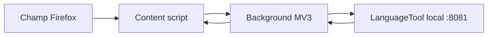

# Architecture

## Version 0.1

La première version sépare volontairement l’interface navigateur du moteur de correction :

Le script de contenu extrait uniquement le texte du champ actif, attend la fin de la frappe puis demande une vérification au background. Le background applique les réglages, bloque les hôtes non locaux et appelle `/v2/check`. Le script de contenu dessine ensuite les soulignements et applique la suggestion choisie.

## Composants

| Composant | Responsabilité |
|---|---|
| `shared/core.js` | Validation pure, normalisation des réglages et réponses LanguageTool |
| `background/background.js` | Stockage, politique réseau locale et appels HTTP |
| `content/content.js` | Détection des éditeurs, temporisation, rendu et remplacement |
| `popup/` | Activation du domaine courant et état du champ actif |
| `options/` | Adresse locale, langue, niveau et délai |

## Choix de sécurité

- les fonctions de normalisation refusent toute URL qui n’est pas une adresse de bouclage ;
- aucun script distant, `eval` ou constructeur dynamique n’est autorisé ;
- les requêtes utilisent `credentials: omit`, interdisent les redirections et expirent après 12 secondes ;
- aucune permission de téléchargement, presse-papiers, historique ou identité n’est demandée ;
- le manifeste déclare explicitement qu’aucune donnée n’est collectée.

## Cible multiplateforme

L’extension elle-même est identique sur Windows, Linux et macOS. La différence concerne le processus LanguageTool :

| Système | Fournisseur local visé |
|---|---|
| Linux | Eloquent Flatpak, avec API locale explicitement activée |
| macOS | port natif d’Eloquent ou petit lanceur signé/notarié |
| Windows | lanceur PowerShell pour le développement, puis compagnon packagé |

Un protocole Native Messaging pourra ultérieurement démarrer et arrêter le moteur. Les échanges de texte resteront sur l’API HTTP de bouclage afin de conserver la compatibilité avec Eloquent et de limiter la complexité du connecteur natif.
