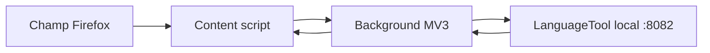

# Architecture

## Version 0.1.7

La première version sépare volontairement l’interface navigateur du moteur de correction :

Le script de contenu retrouve le véritable champ dans le chemin composé des événements, dans la sélection courante, un Shadow DOM ouvert ou une iframe à origine dérivée, puis extrait uniquement son texte. Les éditeurs Quill, ProseMirror, Lexical et Slate disposent de marqueurs explicites. Les descendants qui héritent seulement de `isContentEditable` ou de `-moz-user-modify` ne sont jamais traités comme des champs autonomes : le script remonte jusqu'à l'hôte d'édition. Chaque modification incrémente une génération de requête et retire immédiatement la présentation précédente ; une réponse appartenant à une ancienne génération est ignorée. Le background choisit localement une langue explicite, appelle `/v2/check`, ajoute les règles contextuelles locales puis fusionne les zones qui se chevauchent. Au clic, la position du curseur détermine l’offset textuel ciblé ; les rectangles graphiques ne servent que de solution de secours et d’ancrage du popup. Un éditeur riche reçoit une seule transaction de remplacement par clic afin que son propre modèle ne puisse pas appliquer la correction une seconde fois.

## Composants

| Composant | Responsabilité |
|---|---|
| `shared/core.js` | Validation pure, sélection locale de la langue, normalisation des réglages et réponses LanguageTool |
| `background/background.js` | Stockage, politique réseau locale et appels HTTP |
| `content/content.js` | Détection des éditeurs, temporisation, rendu et remplacement |
| `popup/` | Activation du domaine courant et état du champ actif |
| `options/` | Adresse locale, langue, niveau et délai |

## Choix de sécurité

- les fonctions de normalisation refusent toute URL qui n’est pas une adresse de bouclage ;
- aucun script distant, `eval` ou constructeur dynamique n’est autorisé ;
- les requêtes utilisent `credentials: omit`, interdisent les redirections et expirent après 12 secondes ;
- aucune permission de téléchargement, presse-papiers, historique ou identité n’est demandée ;
- le manifeste déclare explicitement qu’aucune donnée n’est collectée.

## Cible multiplateforme

L’extension elle-même est identique sur Windows, Linux et macOS. La différence concerne le processus LanguageTool :

| Système | Fournisseur local visé |
|---|---|
| Linux | Eloquent ou le compagnon Flatpak de développement |
| macOS | Eloquent Local Companion `0.2.0` |
| Windows | Eloquent Local Companion `0.2.0` |

Un protocole Native Messaging pourra ultérieurement démarrer et arrêter le moteur. Les échanges de texte resteront sur l’API HTTP de bouclage afin de conserver la compatibilité avec Eloquent et de limiter la complexité du connecteur natif.
